# 🏗 Design Document — Recipe Sharing API

## 1. Database Schema

### Entity Relationship Diagram

```mermaid
erDiagram
    USER ||--o{ RECIPE : creates
    RECIPE ||--o{ RATING : receives

    USER {
        text id PK "UUID"
        text username UK "unique, required"
        text email UK "unique, required"
        datetime created_at
        datetime updated_at
    }

    RECIPE {
        text id PK "UUID"
        text title "required"
        text description
        text image_url "path to processed image"
        text ingredients "JSON array string"
        int prep_time "minutes"
        int cook_time "minutes"
        int servings "default: 1"
        float average_rating "computed"
        text user_id FK "→ USER.id"
        datetime created_at
        datetime updated_at
    }

    RATING {
        text id PK "UUID"
        text recipe_id FK "→ RECIPE.id"
        text user_name "who rated"
        int score "1-5"
        text comment "optional"
        datetime created_at
        datetime updated_at
    }
```



### Key Schema Decisions

| Field | Design Choice | Why |
|-------|--------------|-----|
| `ingredients` | JSON string in TEXT column | SQLite lacks native JSON type. Stored as `["tomato","onion"]`, searched with LIKE |
| `average_rating` | Denormalized field on Recipe | Avoids JOIN on every recipe list query. Recalculated on each new rating |
| `user_name` on Rating | Plain text, not FK | Simplified for hackathon — allows rating without strict user registration |
| Primary Keys | UUID (text) | Better for APIs than auto-increment — no info leakage, merge-friendly |

---

## 2. Architecture Flow

### Request Lifecycle

```mermaid
sequenceDiagram
    participant Client
    participant Gin as Gin Router
    participant MW as Middlewares
    participant Ctrl as Controller
    participant DB as GORM/SQLite
    participant Img as Image Utils

    Client->>Gin: HTTP Request
    Gin->>MW: Error Recovery
    MW->>MW: CORS Headers

    alt Recipe with Image Upload
        MW->>MW: Upload Middleware (parse multipart)
        MW->>MW: Validate file type & size
        MW->>MW: Save raw file to temp
    end

    MW->>Ctrl: Handler Function
    Ctrl->>DB: GORM Query
    DB-->>Ctrl: Result

    alt Image was uploaded
        Ctrl->>Img: ProcessImage(rawPath)
        Img->>Img: Open → Resize (800px) → JPEG 80%
        Img-->>Ctrl: processedFilename
    end

    Ctrl-->>Client: JSON Response (APIResponse envelope)
```



### Layer Mapping (Go ↔ Node.js)

```
main.go              ←→  index.js / server.js
src/routes/           ←→  routes/
src/controllers/      ←→  controllers/
src/middlewares/       ←→  middlewares/ (multer, errorHandler)
src/models/           ←→  models/ (Mongoose schemas)
src/db/               ←→  config/db.js
src/utils/            ←→  utils/ (helpers)
```

---

## 3. Image Compression Pipeline

### Flow

```mermaid
flowchart LR
    A[📷 User uploads image] --> B[Upload Middleware]
    B --> C{Valid type?}
    C -->|No| D[❌ 400 Error]
    C -->|Yes| E{Under size limit?}
    E -->|No| F[❌ 400 Error]
    E -->|Yes| G[Save raw to temp]
    G --> H[Controller calls ProcessImage]
    H --> I[Open with imaging lib]
    I --> J[Resize to max 800px wide]
    J --> K[Encode JPEG at 80% quality]
    K --> L[Save to public/temp/]
    L --> M[Delete raw upload]
    M --> N[✅ Store filename in DB]
```



### Technical Details

| Step | Implementation | Config |
|------|---------------|--------|
| **Accept** | Middleware checks Content-Type | JPEG, PNG only |
| **Size Limit** | `header.Size` check | `MAX_UPLOAD_SIZE` env (default 10MB) |
| **Resize** | `imaging.Resize(src, maxWidth, 0, Lanczos)` | `IMG_MAX_WIDTH` env (default 800px) |
| **Compress** | `imaging.Save(img, path, JPEGQuality(q))` | `IMG_QUALITY` env (default 80) |
| **Serve** | `router.Static("/uploads", uploadDir)` | `UPLOAD_DIR` env (default `./public/temp`) |

### Why This Approach?

- **`disintegration/imaging`**: Pure Go, no CGO/libvips dependency — works on any OS without setup
- **Synchronous processing**: For hackathon simplicity; production would use a background job queue
- **JPEG output**: Universal format with good compression ratio
- **800px max width**: Optimized for web display while maintaining visual quality
- **80% quality**: Sweet spot between file size and visual quality (~60-70% size reduction)

---

## 4. API Response Envelope

Every endpoint returns a consistent JSON structure:

```json
{
    "success": true,
    "message": "Recipe created successfully! 🎉",
    "data": { ... }
}
```

For paginated endpoints:
```json
{
    "success": true,
    "message": "Recipes fetched successfully",
    "data": [ ... ],
    "page": 1,
    "per_page": 10,
    "total_count": 42
}
```

This consistency makes frontend integration predictable — the client always checks `response.success` first.
